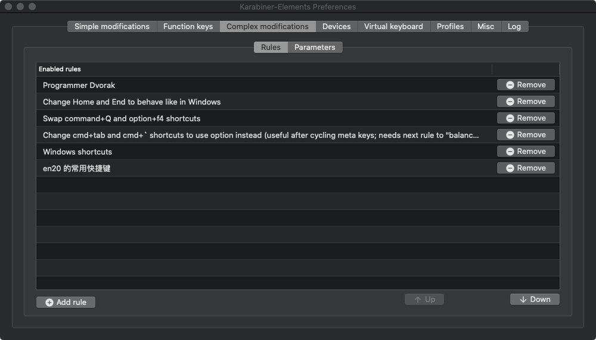

# 1. dvorak_AutoHotkey
自用dvorak键位布局


非常感谢 TANG ZhiXiong 给了我的布局很大参考 https://github.com/district10/neo_keyboard_layout

## 1.1. 添加一些自定义的快捷键
- 77 = (res) => { } 
 
- alt + y = 邮箱


# 2. Mac

mac 的修改实现使用了 [`Karabiner-Elements`](https://karabiner-elements.pqrs.org/docs/).

## 2.1. Installation

### 2.1.1. Copy JSON rules

Copy `programmer-dvorak.json` to `/Users/{your-name}/.config/karabiner/assets/complex_modifications`
(Command + Shift +. To show hidden files)

### 2.1.2. Create Profiles
Create one profile called `QWERTY` and one profile called `DVORAK`. Names must be exact.

### 2.1.3. Set QWERTY Rule
- Switch to `QWERTY` profile.
- Go to Complex Modifications tab.
- Select "Add Rule" at bottom left.
- Enable rule "Programmer Dvorak - QWERTY Switcher"

### 2.1.4. Set DVORAK Rule
- Switch to `DVORAK` profile.
- Go to Complex Modifications tab.
- Select "Add Rule" at bottom left.
- Enable rule "Programmer Dvorak"


## 2.2. 快速切换

alt + 0 切换到 qwer

alt + 1 切换到 dvorak

## 2.3. json 配置文件
`Karabiner-Elements` 的配置文件不能添加额外字段作为注释,否则这条规则就不能生效

```
{
    "type": "basic",
    "from": { // from 區塊定義了按下什麼以後會觸發 map 事件
        "key_code": "KEY" // 一般非 modifier 的按鍵
        "modifiers": { // 使用哪些 modifier 的按鍵
            "mandatory": [ // 必要的 modifier 按鍵，有了才會觸發
            ],
            "optional": [ // 非必要的 modifier，按了也認定可以觸發此 rule
            ]
        }
    },
    "to": [// to 區塊定義了要 map 到什麼動作
        {
            "key_code": "target_key"
        },
        ... // 更多的 key_code
    ]
}
```

## 2.4. mac 的其他快捷键修改



## 2.5. mac 下鼠标无法使用侧键前进后退
加载 `mouse-browser-back.json`,目前用的毒蝰 mini 完美,在 idea 也能退回上次位置
