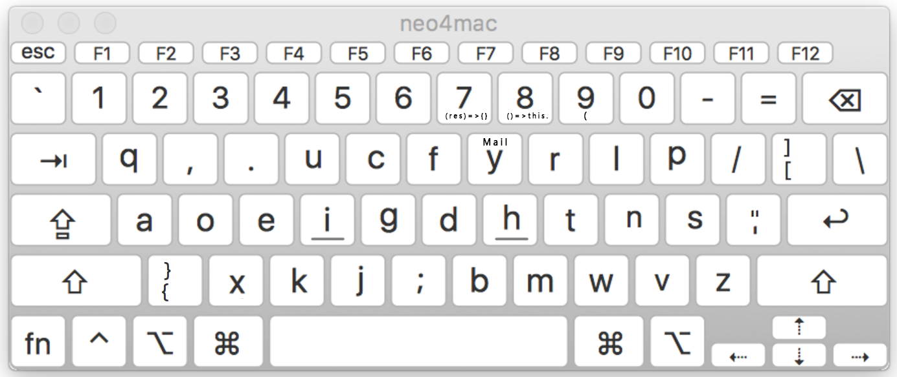
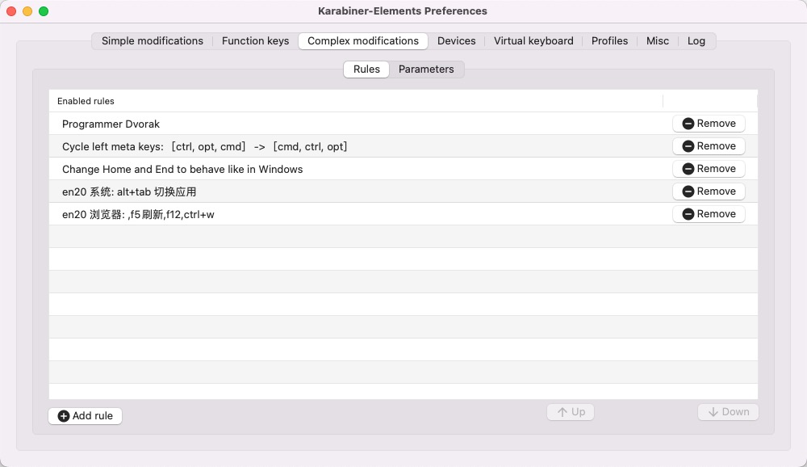

# 1. dvorak_AutoHotkey
自用dvorak键位布局



非常感谢 TANG ZhiXiong 给了我的布局很大参考 https://github.com/district10/neo_keyboard_layout

# 2. Mac

mac 的修改实现使用了 [`Karabiner-Elements`](https://karabiner-elements.pqrs.org/docs/).

## 2.1. Installation

### 2.1.1. Copy JSON rules
```bash
open /Users/$USER/.config/karabiner/assets/complex_modifications
```
Copy `programmer-dvorak.json` to this folder
(Command + Shift +. To show hidden files)

### 2.1.2. Create Profiles
Create one profile called `QWERTY` and one profile called `DVORAK`. Names must be exact.

### 2.1.3. Set QWERTY Rule
- Switch to `QWERTY` profile.
- Go to Complex Modifications tab.
- Select "Add Rule" at bottom left.
- Enable rule "Programmer Dvorak - QWERTY Switcher"

### 2.1.4. Set DVORAK Rule
- Switch to `DVORAK` profile.
- Go to Complex Modifications tab.
- Select "Add Rule" at bottom left.
- Enable rule "Programmer Dvorak"


## 2.2. 快速切换

alt + 0 切换到 qwer

alt + 1 切换到 dvorak

## 2.3. json 配置文件
`Karabiner-Elements` 的配置文件不能添加额外字段作为注释,否则这条规则就不能生效

```
{
    "type": "basic",
    "from": { // from 區塊定義了按下什麼以後會觸發 map 事件
        "key_code": "KEY" // 一般非 modifier 的按鍵
        "modifiers": { // 使用哪些 modifier 的按鍵
            "mandatory": [ // 必要的 modifier 按鍵，有了才會觸發
            ],
            "optional": [ // 非必要的 modifier，按了也認定可以觸發此 rule
            ]
        }
    },
    "to": [// to 區塊定義了要 map 到什麼動作
        {
            "key_code": "target_key"
        },
        ... // 更多的 key_code
    ]
}
```

## 2.4. mac 的其他快捷键修改



## 2.5. mac 下鼠标无法使用侧键前进后退
加载 `mouse-browser-back.json`,目前用的毒蝰 mini 完美,在 idea 也能退回上次位置

## 2.6. 卸载

sudo '/Library/Application Support/org.pqrs/Karabiner-Elements/uninstall.sh'

# 3. Rime 配置

使用的 Rime 配置：雾凇拼音

https://github.com/iDvel/rime-ice

作者博客: https://dvel.me/posts/rime-ice/

自己仓库: https://github.com/Tyrone2333/rime-ice

### 3.1. 个人需求
#### 3.1.1. shift 切换英文

default.yaml 修改 `Shift_L: commit_code` 然后系统偏好输入法里取消掉 `使用大写锁定键切换ABC`

```yaml
ascii_composer:
  good_old_caps_lock: true  # true | false
  switch_key:
    Caps_Lock: clear  # commit_code | commit_text | clear
    Shift_L: commit_code     # commit_code | commit_text | inline_ascii | clear | noop

```

#### 3.1.2. 默认英文标点
rime_ice.schema.yaml

```yaml
- name: ascii_punct
  states: [ 。，, ．， ]
  reset: 0
```
把 reset 改成 1，就默认永远是英文标点。
Ctrl+Shift+3 临时切换。
注释掉 reset 并使用方案选单切换，是永久切换。

#### 3.1.3. 模糊音
rime_ice.schema.yaml

```yaml
speller:
  algebra:
    ### 模糊音
    # 声母
    - derive/^([zcs])h/$1/          # z c s → zh ch sh
    - derive/^([zcs])([^h])/$1h$2/  # zh ch sh → z c s
    # 韵母
    - derive/ang/an/
    - derive/an/ang/
    - derive/eng/en/
    - derive/en/eng/
    - derive/in/ing/
    - derive/ing/in/
```
# 4. todo

mac 版实现了 : ; 对调,但是 win 一直不知道如何实现
